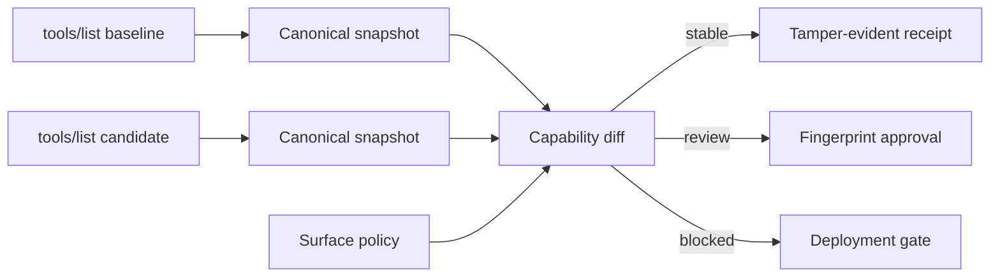

# SurfaceWitness

**A capability-drift firewall for Model Context Protocol tool surfaces.**

An MCP server update can change what an AI agent is able to do without changing
the server name or installation command. A tool can become writable, accept
broader inputs, reach the open world, lose its output contract, or acquire
instructions in its description.

SurfaceWitness captures the callable surface as a content-addressed snapshot,
compares a candidate against a reviewed baseline, and produces a deterministic
decision before the server enters an agent session.



## What it detects

- Added or removed tools
- Tool names matching denied capability patterns
- Read-only tools becoming writable
- Non-destructive tools becoming potentially destructive
- Closed-world tools becoming open-world
- Lost idempotence annotations
- Added, removed, or retyped input properties
- Required inputs becoming optional
- Expanded enums and relaxed numeric or string constraints
- `additionalProperties` becoming enabled
- Removed or changed output schemas
- Changed execution contracts and unclassified metadata
- Oversized descriptions, invisible Unicode, and deterministic instruction
  poisoning signals
- Tool-count budget violations

Each event receives a stable fingerprint. Review approval is bound to that
exact event; another schema or description change produces a different ID.

## Quick start

Requirements: Node.js 20+ and pnpm 10.14+.

```bash
pnpm install
pnpm check

pnpm surface snapshot examples/baseline-tools.json \
  --server support-mcp \
  --server-version 1.4.0 \
  --protocol 2025-11-25 \
  --at 2026-07-29T06:30:00.000Z \
  --output baseline.json

pnpm surface snapshot examples/risky-tools.json \
  --server support-mcp \
  --server-version 2.0.0 \
  --protocol 2025-11-25 \
  --at 2026-07-29T07:30:00.000Z \
  --output candidate.json

pnpm surface diff baseline.json candidate.json \
  --policy examples/policy.json
```

The adversarial example is blocked and exits with code `2`.

For a zero-setup tour:

```bash
pnpm surface demo stable
pnpm surface demo risky
```

## CLI

```text
surface-witness snapshot <tools.json> --server <id> --output <snapshot.json>
surface-witness inspect <snapshot.json> [--json]
surface-witness diff <baseline.json> <candidate.json> --policy <policy.json>
surface-witness explain <baseline.json> <candidate.json> --policy <policy.json> --event <id>
surface-witness receipt <baseline.json> <candidate.json> --policy <policy.json> --output <receipt.json>
surface-witness verify <receipt.json> [--baseline <json>] [--candidate <json>] [--policy <json>]
surface-witness demo [stable|risky]
surface-witness init [directory]
```

Exit codes are stable: `0` stable or valid, `2` blocked, `3` review required,
and `5` invalid input.

## Accepted discovery payloads

The snapshot command accepts all of these offline JSON shapes:

- a raw tool array;
- `{ "tools": [...] }`;
- a JSON-RPC response shaped as `{ "result": { "tools": [...] } }`.

It never launches or connects to an MCP server. Capture `tools/list` using your
trusted client or deployment workflow, then pass the response to SurfaceWitness.

## Approval workflow

Run the diff once and inspect an event:

```bash
pnpm surface diff baseline.json candidate.json \
  --policy policy.json --json

pnpm surface explain baseline.json candidate.json \
  --policy policy.json --event 0123456789abcdef
```

After an authorized reviewer accepts the exact event, add its fingerprint to
`policy.approvals` and run the diff again. Any material change creates a new
fingerprint and invalidates that approval.

Read the [policy reference](docs/POLICY.md) and
[CI integration guide](docs/INTEGRATION.md).

## Surface Studio

```bash
pnpm dev
```

The interactive studio includes stable and adversarial scenarios, risk filters,
tool cards, a fingerprinted drift ledger, and downloadable reports. Analysis
runs entirely in the browser.

## Why annotations are treated conservatively

The MCP specification defines `readOnlyHint`, `destructiveHint`,
`idempotentHint`, and `openWorldHint`, but explicitly treats them as untrusted
hints unless they come from a trusted server. Missing hints use pessimistic
defaults. SurfaceWitness detects annotation drift; it does not claim that an
annotation proves runtime behavior.

The project is informed by:

- [MCP Tool Annotations as Risk Vocabulary](https://blog.modelcontextprotocol.io/posts/2026-03-16-tool-annotations/)
- [MCP specification security guidance](https://modelcontextprotocol.io/specification/2025-11-25/basic/security_best_practices)
- [Model Context Protocol Threat Modeling and Tool Poisoning](https://arxiv.org/abs/2603.22489)
- [MCP Pitfall Lab](https://arxiv.org/abs/2604.21477)

## Security boundary

SurfaceWitness evaluates declared JSON, not server implementation or runtime
behavior. A malicious server can lie in its schemas and annotations. Use this
tool alongside sandboxing, network policy, authorization, code review, and
runtime monitoring. See [THREAT-MODEL.md](docs/THREAT-MODEL.md).

## Repository layout

```text
packages/core    snapshotting, schema diff, policy engine, receipts
packages/cli     automation-friendly command-line interface
apps/studio      interactive browser inspector
examples         baseline and adversarial tools/list payloads
docs             policy, integration, and threat-model references
```

## Contributing

See [CONTRIBUTING.md](CONTRIBUTING.md). Security issues should follow
[SECURITY.md](SECURITY.md).

## License

[MIT](LICENSE)
